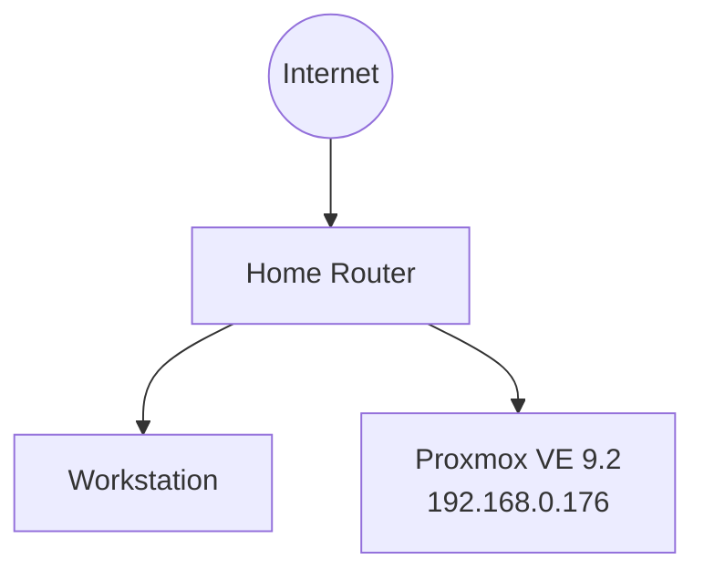
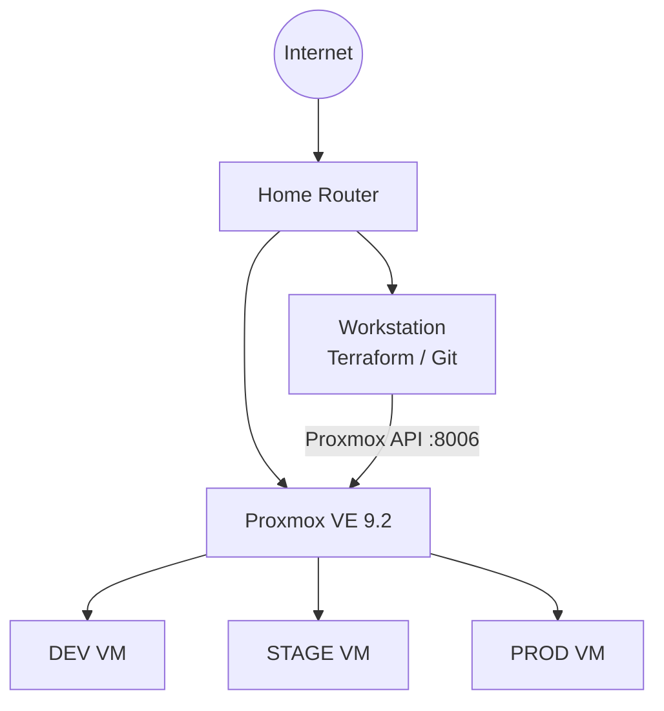
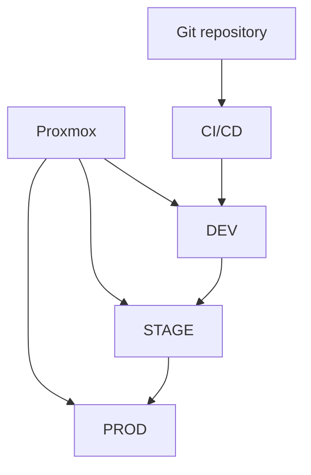

# Architecture overview

## Current state

At the moment the project runs on a single physical Proxmox host.

## Target state — phase 1

Terraform will manage virtual machines on Proxmox.

## Target state — later

The environments will eventually host containerized workloads and Kubernetes.

This diagram represents the target architecture and not the current production state.
